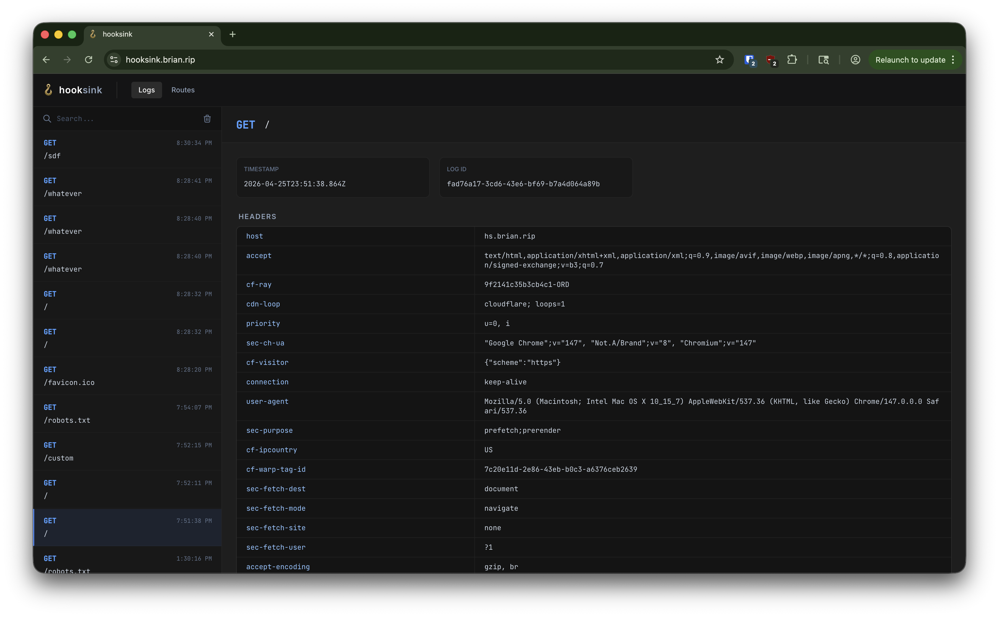
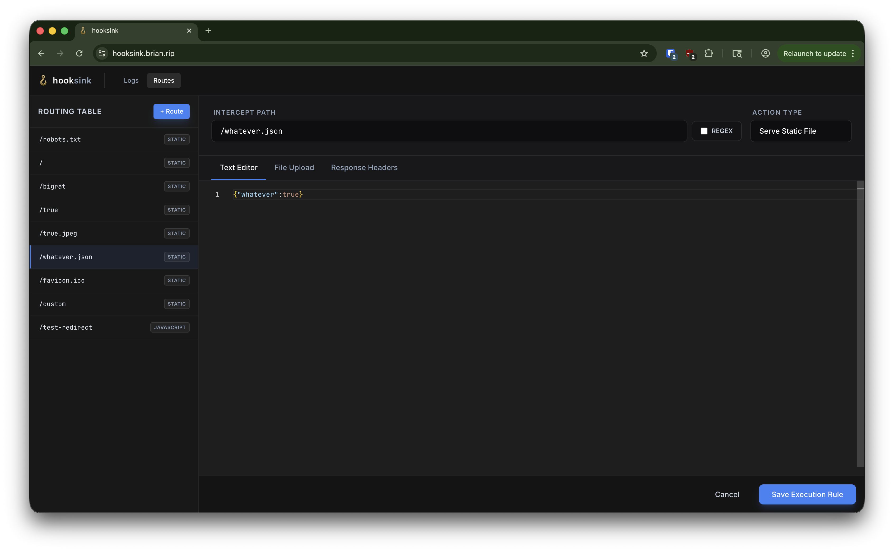
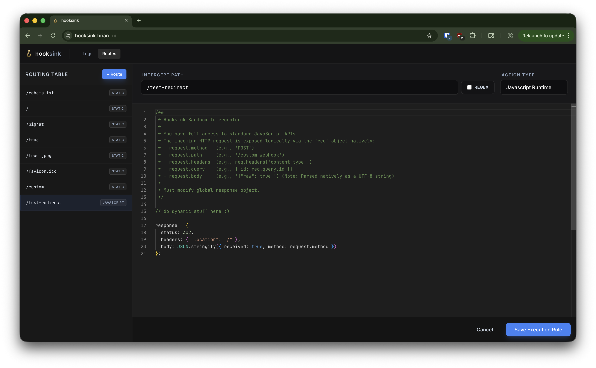

# 🪝 hooksink

Have you ever wondered what [webhook.site](https://webhook.site) would look like if it was made with [Google Antigravity](https://antigravity.google) and AI slop? Look no further!

## Features

- OIDC authentication (implemented by Express middleware because I would never trust AI to write its own authentication)
- No $7.50/mo subscription for basic features for something that can run perfectly fine on my $6/mo VPS that is also running a bunch of other things
- Supposedly some metrics and reporting endpoints for Prometheus
- Absolutely beautiful AI-generated strings littered throughout the UI that make no fucking sense (such as "Binary will be natively buffered via PostgreSQL")
- Deployable with a docker compose file, a .env file, a Cloudflare Tunnel, and a dream
- This README being basically the only human-written file in this repo

### Core Features

#### Request Log

Quite simple. It just shows all the requests that hit the "ingress server" (as Antigravity likes to call it). It includes headers, path, and body. Not much to explain here, as you can see an image of it at the top of this README.

#### Static Handlers

You can write text or upload binary files to be served from any endpoint with any response headers you specify.

#### Custom Handlers

You can also write custom handlers that can do whatever the fuck you want. The code you put in here has full access to the Docker container for the app (so don't grant access to Hooksink to anyone you don't want writing code on the Docker container running it). It supports async/await as well as fetching, so you can write handlers with things like `await fetch('https://google.com/')` and have that run dynamically.

## Setup

*Are you somehow convinced you want to set this up?* Look at the [setup guide](SETUP.md) to read some AI-generated bullshit that might help you. I'd recommend just copying the env and compose file from the setup guide into something like [Komodo](https://komo.do/) and hitting deploy (this worked pretty well for me).

You'll probably want to create a Cloudflare Tunnel that have routes configured to `http://app:3000` for your dashboard/logs domain and `http://app:3001` for the "ingress server" domain (the one you want to receive requests on).

## Motivation and Story

Once upon a time, I used to have a Glitch app that logged all requests through a Discord webhook and also let me quickly modify routes with custom handlers that do whatever the hell I want. As atrocious and hacky as you may think that was, it was absolutely free and still somehow more decent than webhook.site. I used it to help me identify and report many different bugs (such as one where you could send an Instagram DM to someone and it would automatically log their IP address without them having to click on anything).

Unfortunately, Glitch removed free project hosting (and shortly [shut down the entire service because no one was using Glitch for anything else](https://blog.glitch.com/post/goodbye-glitch)), meaning I had to find an alternative solution for an endpoint to use when I needed to use an HTTP server to test something. I tried using webhook.site, and I shortly found out that if I wanted to do basic things (like using `<script>` in a response or generating a new link) I needed to pay $7.50 per month. 

Because I value my money a little bit more than that, I decided it would be really funny if I used Google Antigravity to make a hacky tool that operates similar to my hacky Glitch app (with an actual UI instead of abusing Discord webhooks). If you're wondering why I would use Google Antigravity when many better agentic IDEs exist, it's because I have free Google AI One Ultra Plus (or whatever the hell it's called) for being a student (and this task is not nearly complex enough to warrant paying for Claude Code).

The process of using Google Antigravity was interesting to say the least. It did many things I would have never even thought it would try to do. I genuinely burst out laughing when the first build of the frontend made the request log page [look like a fucking marketing site](docs/images/ai-slop-frontend.png) with a small widget that contains the actual request logs. It's not surprising this marketing page called the shitty node express server handling each route behind a Cloudflare Tunnel a "high performance" product. A "few" more back and forth prompts with it allowed me to get it to a usable state with more of the features and look I wanted, which allows me to do everything I need as a researcher.

Hopefully, I will one day get the motivation to entirely redo this project and write everything by hand. Until that day comes, you can see the horrors of allowing Google Antigravity to write whatever code it wants inside this repository. That being said, the current version of hooksink does actually do mostly everything I want it to do (which isn't much).

## Contributing

Feel free to file issues that I will probably ignore unless the issue starts to bug me too. I really wouldn't recommend making pull requests unless you're spinning up a Claude Code agent or Antigravity or literally rewriting everything. If you do decide contribute, make sure to follow the very important [Code of Conduct](CODE_OF_CONDUCT.md).

## Security

As much of a joke as this repository is, I do actually use the software here for security research and will take valid security reports that bypass auth seriously. The backend is pretty simple and most of the endpoints are protected by express auth middleware, so I don't think there are any major issues here.

If you happen to stumble upon a security issue that's worth reporting to me (i.e. actually exploitable without authentication), send me an email. I'm not going to write out my email here because I'll get 400 spam emails a day if I do that, but it's not hard to guess which domain should go after `security@`. This should go without saying but **do not test against other people's instances (including my instances)**.